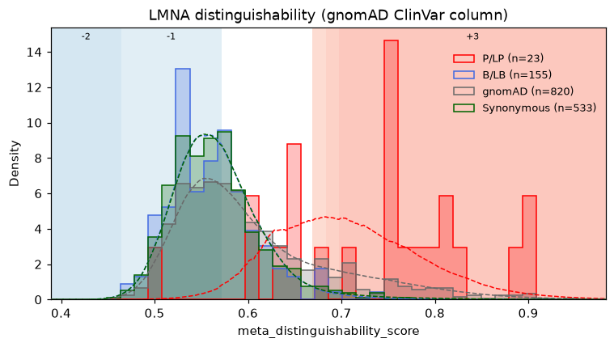
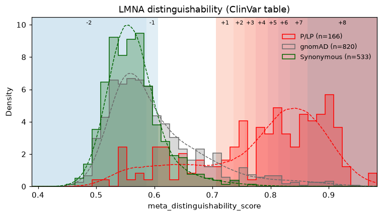

# Evidence calibration (ExCALIBR)

`Dataset.calibrate` turns any per-variant score into ACMG/AMP evidence points, from −8
(benign) to +8 (pathogenic), by comparing where pathogenic and benign control variants
score. It is a native port of ExCALIBR (Zeiberg et al., *Gene-based calibration of
high-throughput functional assays for clinical variant classification*,
[bioRxiv 2025.04.29.651326](https://doi.org/10.1101/2025.04.29.651326)), the method used
for the calibrations in Tejura et al. (bioRxiv 2026, doi:10.64898/2026.02.14.705848).
It needs no JAX and does not depend on the [upstream code](https://github.com/rosstewart/exCALIBR).

```python
import fisseqborn as fb

cal = (fb.OvwtScores.from_pipeline(run)
         .correct("auroc_pooled")
         .per_variant("auroc_pooled_corrected")
         .calibrate("auroc_pooled_corrected",
                    gnomad="gnomAD_v4.1.2_ENSG00000160789.csv"))   # the gene's gnomAD export

cal.df             # + meta_excalibr_group, _groups, _lr, _posterior, _points, _oob
cal.calibration    # the fitted Calibration
fb.CalibrationPlot(cal).save("vis/calibration.png")
cal.calibration.to_json("calibration.json")
```

Any numeric column works, e.g. `meta_distinguishability_score` on `Profiles`.

## Inputs

**One row per variant.** `calibrate` raises if a `meta_aa_changes` label appears more than
once. Pool first with `.per_variant()` on `OvwtScores` or `.median_across_batches()` on
`Profiles`, or filter to one batch to calibrate it alone.

**gnomAD (required).** The CSV export of the gene's page on the
[gnomAD browser](https://gnomad.broadinstitute.org/), downloaded with the
"Export variants to CSV" button. It is the population sample the prior comes from.

- **Matching to `meta_aa_changes`.** `Protein Consequence` (`p.Arg123Trp`) is converted to
  the one-letter label (`R123W`; `p.Arg123Ter` gives `R123*`).
    - Nucleotide variants with the same protein change are collapsed into one: allele counts
      are summed, and the variant counts if any of its nucleotide variants passes.
    - Rows without a single-codon protein change (intronic, UTR, frameshift) are dropped.
- **Filters.** A variant counts only with `Filters - joint == PASS`.
    - `splice_max=0.2` also drops variants with `spliceai_ds_max` above 0.2, the cutoff in
      Zeiberg et al. v2. Use it for assays that cannot see splicing effects.

**ClinVar (optional).** The table `Dataset.clinvar` reads: a `variant` column (`"A12V"`)
and `clinvar_clinical_significance`.

- **Calls that count.** Pathogenic, Likely pathogenic and Pathogenic/Likely pathogenic
  count as P/LP; Benign, Likely benign and Benign/Likely benign count as B/LB. Uncertain,
  conflicting and not-provided calls are not controls.
- **Review stars.** With a `clinvar_review_status` (ClinVar's text) or `clinvar_stars`
  column, records under `min_stars=1` are dropped, as in the paper. Without one, the filter
  is skipped, with a warning.
- **Without a table** (`clinvar=None`), the gnomAD export's `ClinVar Germline
  Classification` column is used. It only covers variants gnomAD observed and has no review
  status, so a warning is logged.
- **Conflicts.** A protein change whose records include both a pathogenic and a benign call
  is left out of the controls.

## Control groups

| Group | From | Notes |
|---|---|---|
| P/LP | ClinVar table, else the gnomAD export's ClinVar column | |
| B/LB | ClinVar table, else the gnomAD export's ClinVar column | |
| gnomAD | gnomAD export, passing the filters | the unlabelled population sample |
| Synonymous | `meta_is_control` rule: synonymous, no `:<tag>` | |

- **Which variants can be controls.** Only single-codon substitutions; multi-codon (`|`)
  labels and `:<tag>` pseudo-variants never are.
- **Overlapping groups.** A variant can be in several groups (a ClinVar variant gnomAD also
  observed is in both). As in the paper, each bootstrap iteration assigns it to one of
  them at random.
- **Group columns.** `meta_excalibr_groups` lists every group a variant is in.
  `meta_excalibr_group` names the first of P/LP, B/LB, Synonymous, gnomAD.

## Method

Each of `n_bootstrap` iterations (1000 in the paper):

1. **Resample.** Assign each multi-group variant to one group. Resample every group with
   replacement at its own size, holding out the variants not drawn.
2. **Fit the mixture.** All groups share the same skew-normal components (2 or 3); each
   group has its own mixing weights.
    - Fit by EM, keeping the best of `n_restarts` on held-out likelihood.
    - A density constraint between neighboring components keeps the likelihood ratio
      monotone wherever the components carry real density.
3. **Prior.** Estimate the prior probability of pathogenicity on the gnomAD scores by
   label-shift EM.
4. **Local likelihood ratio.** Take `LR+(s) = f_P(s) / f_B(s)` on a grid of scores.
   - `f_B` is the benign mixture: B/LB, synonymous, or by default (`benign_method="avg"`)
     their averaged weights, which is steadier when B/LB is small.

Across iterations:

- **Number of components.** With `n_components="auto"` the run fits 2 and 3 components and
  keeps 3 only if it beats 2 on held-out likelihood in at least 95% of iterations.
- **Prior.** The calibration's prior is the median over iterations.
- **Points.** Each point is a fixed step in likelihood ratio: `p` pathogenic points need
  `LR+ ≥ C^(p/8)`, and `p` benign points need `LR+ ≤ C^(−p/8)`.
    - `C` is the Tavtigian constant for the prior: the value that best satisfies the
      ACMG/AMP combining rules (350 at a prior of 0.1, so each point is about a 2.08× step).
    - Pathogenic points use the 5th percentile of `log LR+` across iterations and benign
      points the 95th, so unstable fits give less evidence.
    - The ranges are then made one-sided: one range per point, the strongest point extended
      to the end of the score axis.
- **Direction.** `direction="auto"` takes the direction from which end the pathogenic
  controls sit at.
    - Bidirectional assays (pathogenic at both ends) are detected from the fits and given
      evidence on both sides.
    - `"lower_pathogenic"`, `"higher_pathogenic"` and `"both"` force it.
- **Out-of-bag points.** Each control variant's points use only the iterations that held it
  out (`meta_excalibr_oob`), so the ClinVar controls are not scored by models fit to them.
  Keep this on whenever the score was tuned against ClinVar.
- **One control class.** With only pathogenic, or only benign and synonymous controls, the
  missing class is recovered from gnomAD (positive-unlabeled / negative-unlabeled), with a
  warning.

Columns added:

| Column | |
|---|---|
| `meta_excalibr_group`, `meta_excalibr_groups` | control group(s) |
| `meta_excalibr_lr` | median bootstrap `LR+` at the variant's score |
| `meta_excalibr_posterior` | posterior probability of pathogenicity at the calibration's prior |
| `meta_excalibr_points` | evidence points, −8 to 8 (null without a score) |
| `meta_excalibr_oob` | the points are out-of-bag |

## The `Calibration`

`cal.calibration` holds the thresholds and everything that produced them:

- **Fitted values.** `point_ranges` (score intervals per point), `prior`, `tavtigian_c`,
  `n_components`, `direction`, `mode`.
- **Curves.** The likelihood-ratio curves (`grid`, `log_lr_low`/`_median`/`_high`).
- **Run details.** The `group_counts`, every valid bootstrap fit, the settings and `seed`.
- **Health.** `reliable`, with the reasons in `warnings`.

```python
c = cal.calibration
c.thresholds()          # {1: score where +1 begins, ..., -1: ..., None if never reached}
c.points([0.31, 0.62])  # score new values
c.to_json("calibration.json")

# later, without refitting:
other = fb.Dataset.read("new_scores.parquet").apply_calibration("calibration.json")
```

Results depend only on `seed`, not on `n_jobs`.

## Worked example: LMNA

LOBO distinguishability scores from `notebooks/2026-08-28/ovwtlobo` were calibrated
against the gnomAD v4.1.2 LMNA export. The run used 100 bootstrap iterations, which took
3–4 minutes on 8 cores:

```python
profiles = fb.Profiles(pl.read_parquet("distinguishability.parquet"))  # one row per variant
cal = profiles.calibrate("meta_distinguishability_score",
                         gnomad=GNOMAD_CSV,        # gnomAD_v4.1.2_ENSG00000160789_*.csv
                         clinvar=None,             # or CLINVAR_PATH
                         n_bootstrap=100)
```

| | gnomAD ClinVar column (`clinvar=None`) | `clinvar/clinvar_converted.parquet` |
|---|---|---|
| Controls (P/LP, B/LB, gnomAD, synonymous) | 23, 155, 820, 533 | 166, 1 (dropped), 820, 533 |
| Benign reference | B/LB and synonymous averaged | synonymous only |
| Components (support for 3) | 2 (0.64) | 3 (0.98) |
| Prior, `C` | 0.24, 95 | 0.13, 235 |
| Pathogenic evidence | +1 from 0.669, up to +3 from 0.698 | +1 from 0.706, up to +8 from 0.864 |
| Benign evidence | −1 below 0.572, −2 below 0.464 | −1 below 0.607, −2 below 0.586 |

Higher distinguishability is pathogenic, and both runs detect it (`direction`
`"higher_pathogenic"`).

- **gnomAD ClinVar column.** Few pathogenic controls are in gnomAD, so the pathogenic
  likelihood ratio is uncertain and evidence stops at +3.
- **ClinVar table.** It has 166 P/LP variants but only one benign call, so that group is
  dropped and synonymous variants serve as the benign reference.
    - The pathogenic side then reaches +8.
    - The table has no review status, so neither run applies the paper's one-star filter.





**Out-of-bag points can exceed the calibration's ranges.** A control variant's out-of-bag
points come from its own subset of fits, with that subset's median prior. A few gnomAD
variants in the first run get +4, although the full calibration stops at +3.

## Limits

- **Small control groups.** A control group with fewer than 5 scored variants is dropped
  with a warning, and below 10 the result is flagged `reliable=False`. LMNA has few missense
  controls in gnomAD v4.1.2, so its point ranges are wide and its strongest evidence levels
  are rarely reached. Read `warnings` before using the points.
- **The gnomAD-only ClinVar fallback** sees only variants gnomAD observed, so it has fewer
  controls than ClinVar itself, and it cannot apply the one-star review filter the paper
  uses. Pass a ClinVar table with review status when you can.
- **Run time.** EM runs on the CPU, in parallel across bootstrap iterations.
    - 100 iterations on about 1,600 controls take 1–2 minutes on 8 cores, with 2 and 3
      components both fit.
    - The published setting (1000 iterations, `n_restarts=8`) takes about ten times as
      long. Use `n_bootstrap=100` while exploring and 1000 for anything reported.
- **Differences from upstream ExCALIBR.** Most of these are visible in
  `fisseqborn.calibration._core` and `_mixture`.
    - **Fixes:** the EM log-likelihood uses log mixing weights (upstream adds the raw
      weights), and `Delta` uses Lin et al.'s exact M-step.
    - **Initialization:** components are shrunk until the density constraint holds, as the
      paper describes, rather than by upstream's KL-divergence optimization.
    - **One control class:** the prior uses upstream's mixture-proportion boundary estimator,
      not the EM the supplement describes. That EM, as written, does not converge to the
      mixture proportion.
    - **Not ported:** only upstream's default "liberal" monotonicity post-processing is
      ported, and its pathomechanism and multi-assay options are not.
    - **Agreement:** on upstream's BRCA1 (Findlay et al. 2018) example, the points agree with
      upstream's published calibration to within one at every score. The prior is 0.19
      against upstream's 0.23. Out-of-bag evidence agrees with the ClinVar controls for 98.8%
      of determinate calls (the paper reports 97.9% across genes). The regression is
      `packages/fisseqborn/tests/integration/test_calibration_upstream.py`.
