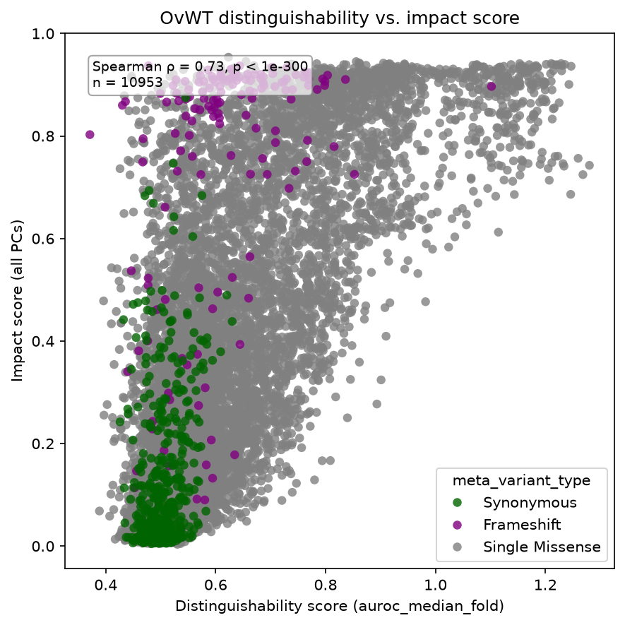
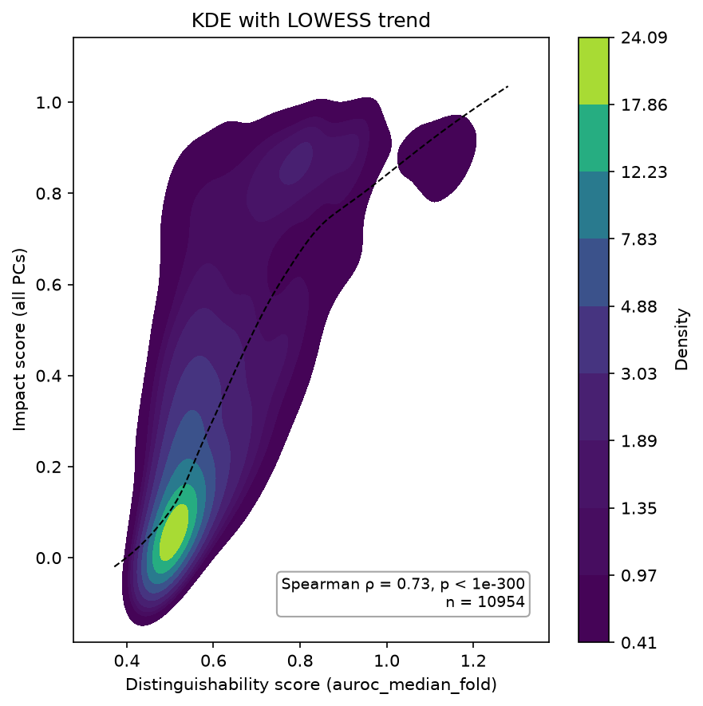
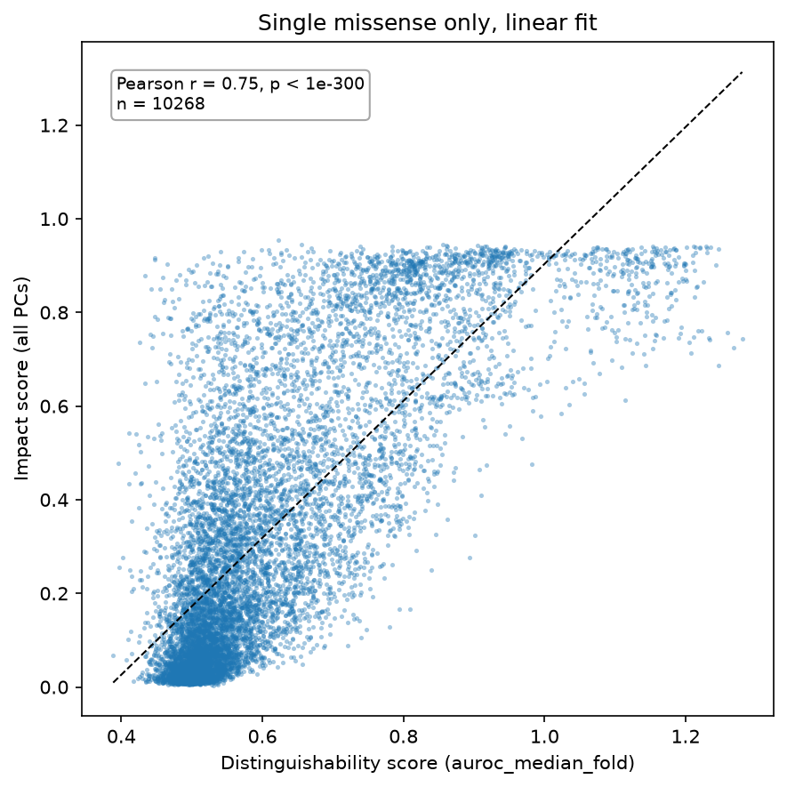
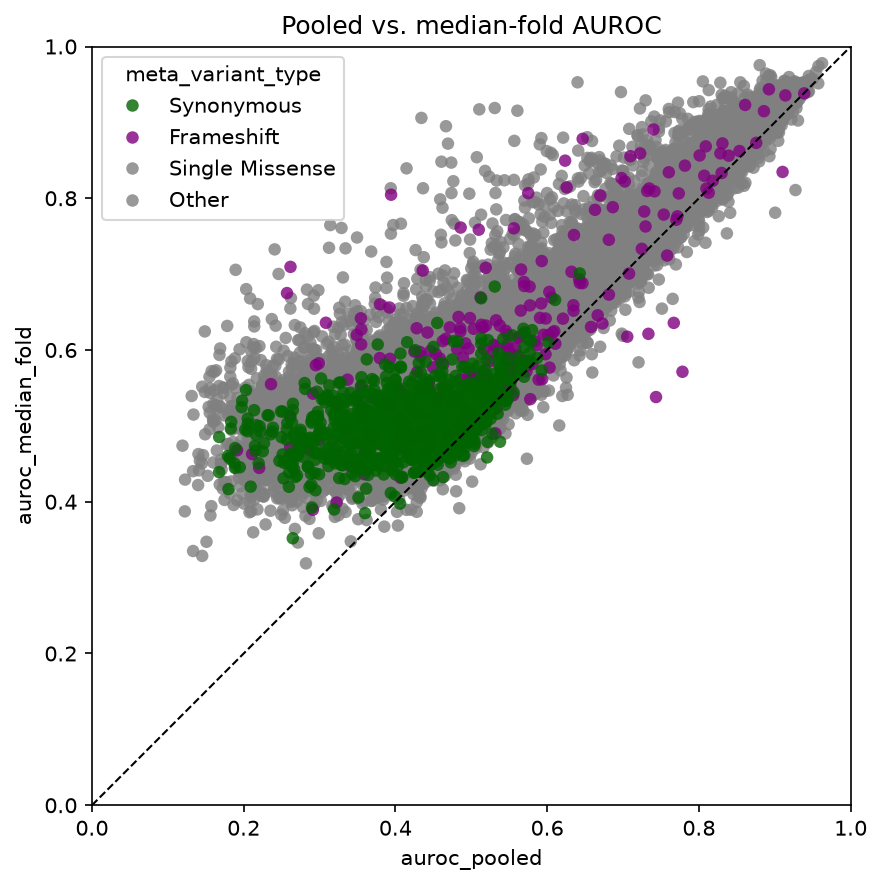
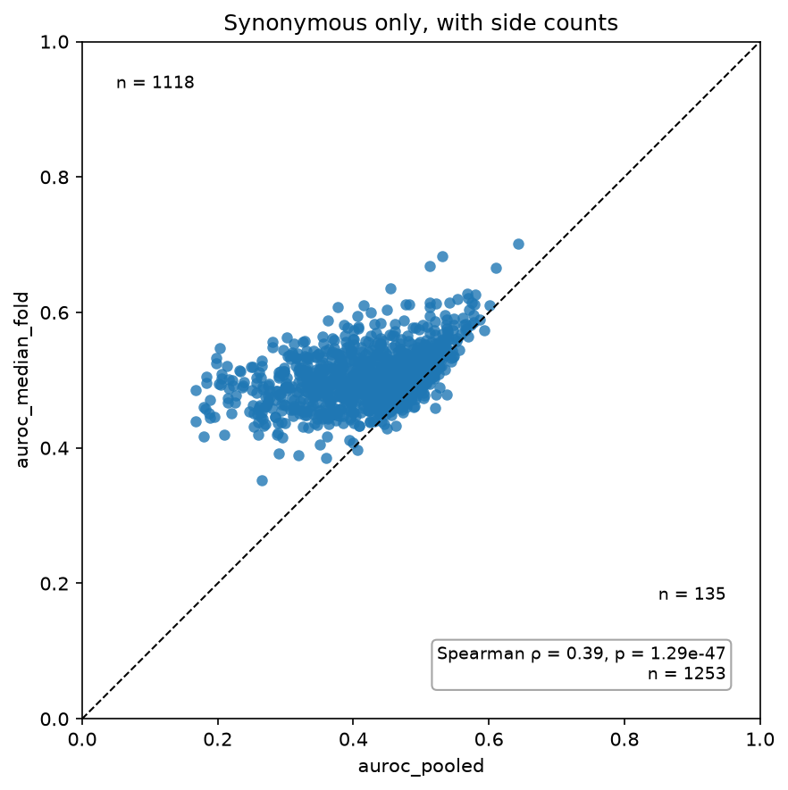

# Correlation scatter

`CorrelationPlot` compares two numeric columns, for example replicate vs. replicate, filtered vs.
unfiltered, or a score vs. cell count. It can add:

- a correlation box (`stat="pearson"` or `"spearman"`, computed over rows where both values are finite)
- a fit line (`fit="linear"` or `"lowess"`)
- the `y = x` line (`identity=True`)
- counts of the points above and below that line (`count_sides=True`)

## Replicate vs. replicate

The two replicates are usually joined side by side first (here with polars' `_right` suffix):

```python
import fisseqborn as fb

pairs = t3_r1.join(t3_r2, on="meta_aa_changes")   # test_auroc, test_auroc_right

(fb.CorrelationPlot(pairs, x="test_auroc", y="test_auroc_right", hue="meta_variant_type",
                    stat="spearman", stat_loc="upper left", identity=True, lims=(0, 1))
   .set(xlabel="OVWT Score T3_R1", ylabel="OVWT Score T3_R2")
   .save("vis/T3_R1_vs_T3_R2_ovwt_scatter.png"))
```

{ width="420" }

*From `notebooks/2026-07-29/ovwt_rep_correlation`.*

## Score vs. cell count

`kind="kde"` draws a filled 2-D density in place of the points, and `fit="lowess"` adds a dashed LOWESS
trend:

```python
(fb.CorrelationPlot(df, x="meta_num_cells", y="test_auroc_corrected",
                    kind="kde", fit="lowess", stat="spearman",
                    title="AUROC vs. Cell Count (All Variants)")
   .set(ylim=(0, 1), xlim=(0, None))
   .save("vis/auroc_vs_num_cells_kde_all.png"))
```

{ width="420" }

*From `notebooks/2026-07-30/ovwt_scores_cell_count`. Without `hue`, fisseqborn's KDE uses viridis
with a density colorbar. Pass `cmap=` or `cbar=False` to change that.*

## Distinguishability vs. impact score

With `hue`, sort the rows first to choose what is drawn on top. Here the Synonymous controls are
drawn last, over the missense cloud:

```python
import polars as pl

hue_order = ["Synonymous", "Frameshift", "Single Missense"]
scored = (profiles.impact_scores([1.0])
          .distinguishability(ovwt, score="auroc_median_fold"))

(fb.CorrelationPlot(
    scored.filter(pl.col("meta_variant_type").is_in(hue_order)).sort(
        pl.col("meta_variant_type").replace_strict({t: i for i, t in enumerate(hue_order)}),
        descending=True,
    ),
    x="meta_distinguishability_score", y="meta_impact_score_1.0",
    hue="meta_variant_type", hue_order=hue_order,
    stat="spearman", stat_loc="upper left", figsize=(6, 6),
    title="OvWT distinguishability vs. impact score",
 )
 .set(xlabel="Distinguishability score (auroc_median_fold)", ylabel="Impact score (all PCs)")
 .save("vis/distinguishability_vs_impact.png"))
```

{ width="420" }

*From `notebooks/2026-10-01/dist-vs-impact`. `stat_loc` moves the statistics box away from the
legend.*

The same data as a density with a LOWESS trend (`kind="kde", fit="lowess"`), and the single
missense variants alone with a linear fit (`fit="linear"`, `stat="pearson"`). Extra keywords such
as `s=6, alpha=0.4` go to the scatter:

<div class="grid" markdown>





</div>

## Pooled vs. median-fold AUROC

`identity=True` with `lims=(0, 1)` draws the `y = x` line on square axes. `stat=None` drops the
statistics box:

```python
scores = fb.OvwtScores.from_pipeline(OVWT_PIPELINE_DIR).pipe(pl.LazyFrame.drop_nulls).variant_type()

(fb.CorrelationPlot(scores, x="auroc_pooled", y="auroc_median_fold",
                    hue="meta_variant_type", hue_order=hue_order,
                    stat=None, identity=True, lims=(0, 1), figsize=(6, 6))
   .save("vis/pooled_vs_median_fold.png"))
```

`count_sides=True` writes how many points fall above and below that line. For synonymous variants
alone, the median-fold score sits above the pooled one for 1118 of 1253 variants:

<div class="grid" markdown>





</div>

*From `notebooks/2026-09-29/ovwtcv`.*

Use `CorrelationPlot(...).correlation()` to get `(statistic, p_value, n)` without drawing anything.
