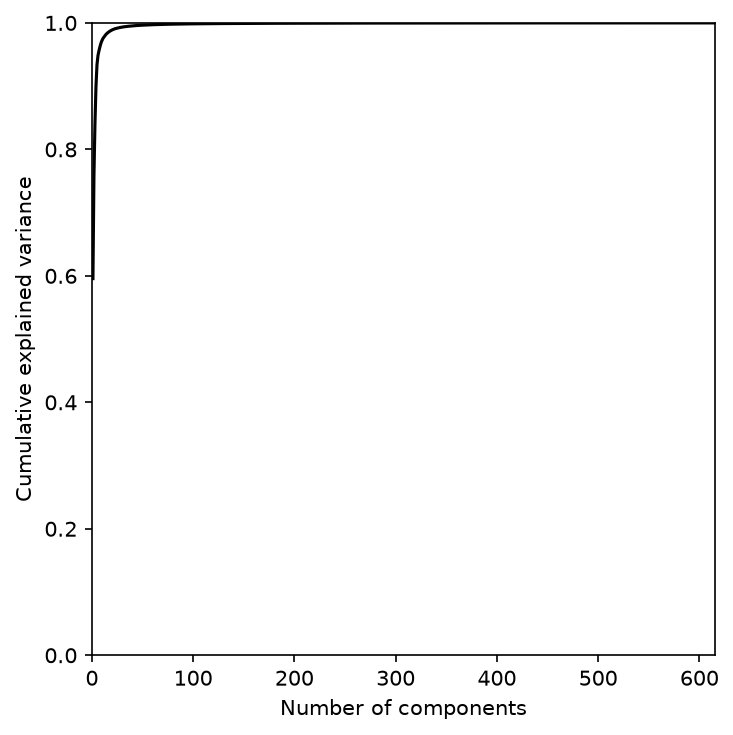
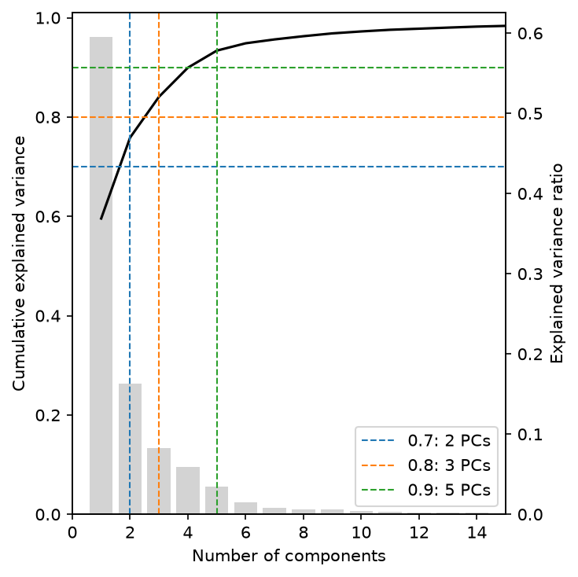
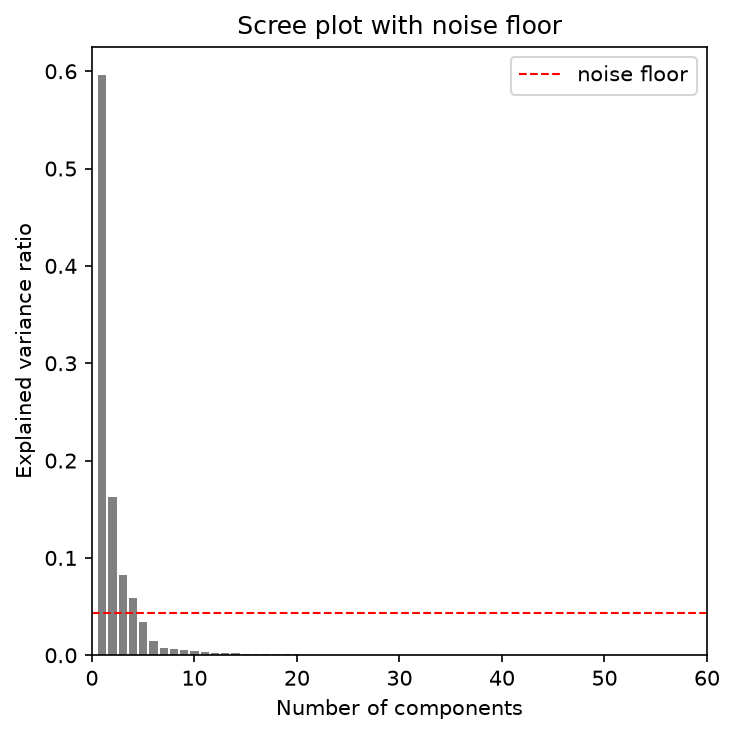

# Explained variance

`ExplainedVariancePlot` shows how much variance each principal component of a PCA fit explains. It
answers "how many PCs should I keep?" before you choose a `variance=` threshold for
`Profiles.pca_reduce` or a list of ratios for `Profiles.impact_scores`.

It accepts either a table with one row per component and an `explained_variance_ratio` column
(`Profiles.pca_explained_variance`), or a `Profiles` that already carries a PCA fit, such as the
result of `pca_reduce()` or `impact_scores()`.

## Cumulative explained variance

```python
import fisseqborn as fb

ok_features = fb.Blocklists.from_pipeline(PIPELINE_DIR).rethreshold(0.8).consensus()
profiles = (
    fb.Profiles.from_pipeline(PIPELINE_DIR, types=["median", "KS", "AUROC"])
    .variant_type()
    .median_across_batches()
    .keep_features(ok_features)
    .drop_nonfinite()
)

# fits PCA once, adding one impact score column per threshold
scored = profiles.impact_scores([0.7, 0.8, 0.9, 1.0])

(fb.ExplainedVariancePlot(scored)
   .set(xlim=(0, None), ylim=(0, 1))
   .save("vis/cumulative_explained_variance.png"))
```

{ width="420" }

*From `notebooks/2026-09-30/pca`. Of the ~600 components, the first handful explain almost
everything.*

## Scree bars and thresholds

`kind="both"` adds the per-component ratios as bars on a second y axis. `thresholds=` marks each
cumulative ratio with a dashed horizontal line, plus a vertical line at the fewest components that
reach it, which is the number `pca_reduce(variance=…)` would keep. Zoom in with `xlim` when
the tail is long:

```python
(fb.ExplainedVariancePlot(scored, kind="both", thresholds=[0.7, 0.8, 0.9])
   .set(xlim=(0, 15))
   .save("vis/explained_variance_both.png"))
```

{ width="420" }

The legend reads `0.9: 5 PCs` and so on. `palette=` sets the threshold line colors, keyed by
threshold, and `x="fraction"` puts the fraction of all components on the x axis in place of the
count.

## Noise floor

`pca_reduce(noise_floor=True)` fits PCA to a column-shuffled copy of the data as well, and keeps
the components that explain more variance than the first shuffled component. Pass the result with
`kind="scree"` to see that cut-off. It is picked up from the `Profiles` automatically, or you can
pass `noise_floor=` yourself:

```python
reduced = profiles.pca_reduce(variance=0.9, noise_floor=True)
(fb.ExplainedVariancePlot(reduced, kind="scree", title="Scree plot with noise floor")
   .set(xlim=(0, 60))
   .save("vis/scree_noise_floor.png"))
```

{ width="420" }
