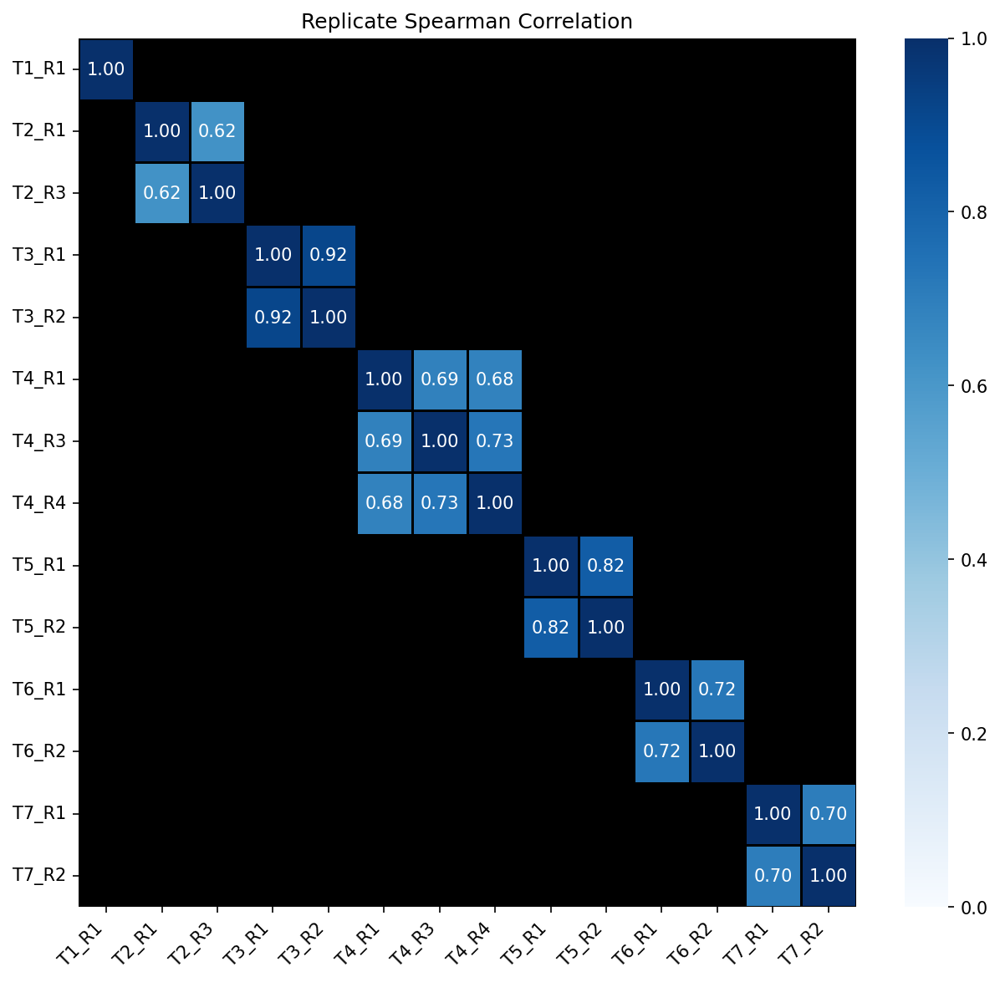
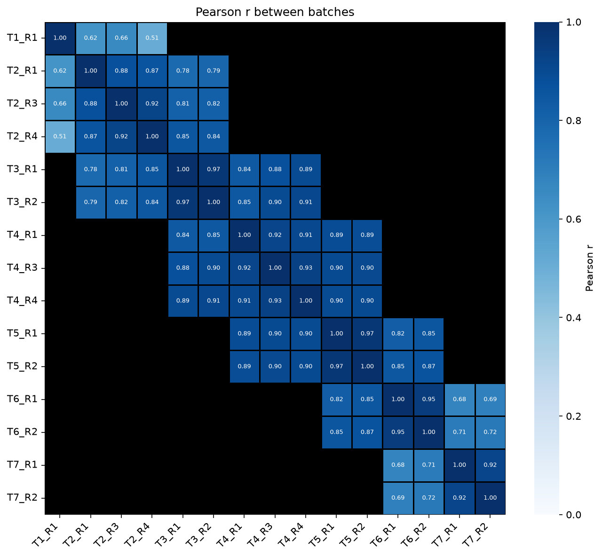
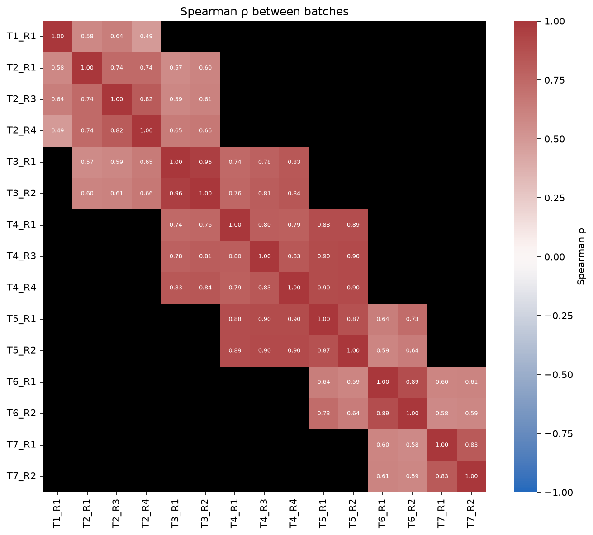
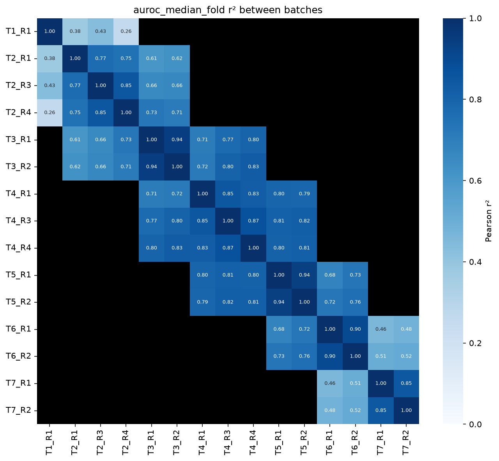

# Heatmaps

`Heatmap` draws a matrix given in either of two forms:

- **Long form:** one row per cell, with `index`, `columns` and `values` columns. It is pivoted for you.
- **Wide form:** an `index` column plus the matrix columns (`columns=[…]`, or every numeric column).

Rows and columns are sorted naturally unless you pass `row_order` / `col_order`. Any extra keyword
arguments, such as `linewidths` or `linecolor`, go straight to `seaborn.heatmap`.

## Pairwise matrix stored once per pair

Pairwise results are usually stored once per pair. `symmetric=True` fills each missing `(j, i)` cell
from `(i, j)`. `nan_color` sets the color shown for pairs that were never compared:

```python
import fisseqborn as fb

# one row per replicate pair within a tile (each replicate with itself too):
# rep_a, rep_b, spearman_r
(fb.Heatmap(rep_corr, index="rep_a", columns="rep_b", values="spearman_r",
            symmetric=True, nan_color="black",
            cmap="Blues", vmin=0, vmax=1, annot=True, fmt=".2f",
            linewidths=0.5, linecolor="black",
            figsize=(10, 9), title="Replicate Spearman Correlation")
   .save("vis/replicate_spearman_correlation_heatmap.png"))
```

{ width="520" }

*From `notebooks/2026-07-29/ovwt_rep_correlation`.*

## Batch correlation matrices

`BatchCorrelationHeatmap` computes that replicate matrix from the raw scores. You pass long-form
data with a `batch` column, a `label` column and a `score` column. Each cell is the correlation
(Spearman by default) of `score` between two batches, using one point per label the two batches
share. Pairs of batches that share no labels, or fewer than `min_shared` (default 10), are drawn
black:

```python
# one row per (experiment, variant): experiment, variant, test_auroc
(fb.BatchCorrelationHeatmap(ovwt, batch="experiment", label="variant", score="test_auroc",
                            title="Replicate Spearman Correlation")
   .save("vis/replicate_spearman_correlation_heatmap.png"))
```

{ width="520" }

*`method="pearson"` on the 2026-09-29 OvWT scores (`batch="meta_experiment",
label="meta_aa_changes", score="auroc_median_fold"`). Batches on different tiles share no
variants, so only the block diagonal is filled.*

`method=` can be `"spearman"`, `"pearson"` or `"cosine"`, and `squared=True` shows the
squared correlation (for example ρ²). `.pairs()` returns the numbers behind the plot:
`batch_a, batch_b, r, r_squared, n_shared`. Duplicate
`(batch, label)` rows are an error unless you pass `aggregate="mean"` (or similar).

`fill_value=` fills whatever is still missing, for example `fill_value=0.5` for barcode-pair AUROC
matrices. Duplicate `(index, columns)` pairs are an error unless you pass `aggregate="mean"` (or
`"median"`, `"first"`, …).

## Correlation matrices

`Heatmap.correlation` computes the matrix for you: Pearson, Spearman, or cosine similarity between
columns. It defaults to a diverging `vlag` scale from -1 to 1 with annotations:

```python
pcs = [f"meta_pc_{i}" for i in range(1, 6)]
fb.Heatmap.correlation(df, pcs, method="cosine").save("vis/pc_similarity.png")
```

Each cell is computed over the rows where both of its columns are finite, so sparse inputs work.
For example, you can pass one column per batch where each batch covers a single tile. Spearman
ranks within each pair's shared rows. Cells with fewer than `min_shared` shared rows (default 10)
are NaN, so pass `nan_color="black"` to show them. The shared-row counts are on the plot's
`n_shared` attribute. Pass `squared=True` to show r² (or ρ²) on a 0–1 `Blues` scale instead:

```python
by_batch = scores.df.pivot(on="meta_experiment", index="meta_aa_changes",
                           values="auroc_median_fold")
plot = fb.Heatmap.correlation(by_batch, [c for c in by_batch.columns if c != "meta_aa_changes"],
                              nan_color="black")
plot.n_shared  # pandas DataFrame of shared variants per batch pair
```

<div class="grid" markdown>





</div>

*From `notebooks/2026-09-29/ovwtcv`, with `nan_color="black", min_shared=10,
annot_kws={"fontsize": 6}`: `method="spearman"` (left) and `squared=True` (right).*

!!! tip
    Cosine similarity doesn't center the data. On AUROC-like scores, which all sit near 0.5, every
    pair comes out at about 0.99. Use Pearson or Spearman for those.

Use `Heatmap(...).matrix()` to get the drawn matrix as a pandas DataFrame.
