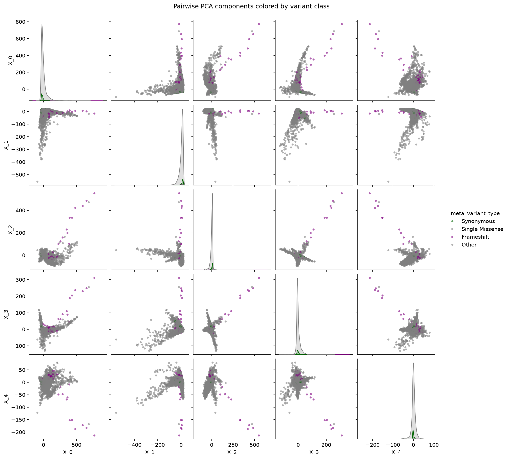
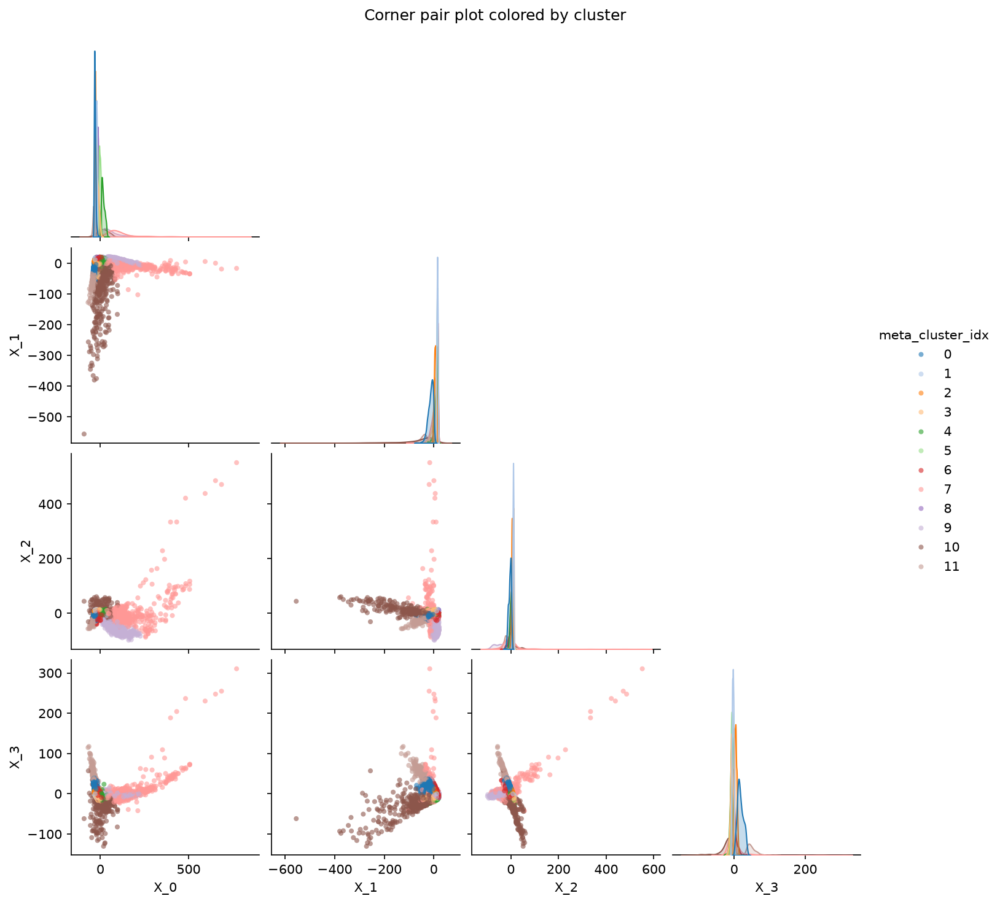

# Pair plots

`PairPlot` wraps `seaborn.pairplot`: a grid of pairwise scatter plots of `vars`, with each
variable's distribution on the diagonal. Categorical `hue` levels get the fisseq order and
palette when they are known (variant types, for example). Otherwise they are put in natural
order, so cluster `"2"` comes before `"10"`.

It is figure-level. Each panel is `height` inches square (2.4 by default), and the figure size
follows from that, so `figsize` isn't accepted. `plot()` returns `(fig, PairGrid)`.

## Principal components by variant class

```python
import fisseqborn as fb

pc_cols = [f"X_{i}" for i in range(5)]
(fb.PairPlot(spatial, vars=pc_cols, hue="meta_variant_type",
             title="Pairwise PCA components colored by variant class")
   .save("vis/global_profiles_pc_variant_type.png"))
```



*From `notebooks/2026-09-30/pca`, where `spatial` holds the PCs from
`profiles.pca_reduce(variance=1.0)`.*

## Corner plot by cluster

`corner=True` draws only the lower triangle. With a cluster `hue`, you can see which PCs separate
the Leiden clusters. Here cluster 10 runs out along `X_1` and cluster 7 along `X_2`/`X_3`:

```python
(fb.PairPlot(spatial, vars=pc_cols[:4], hue="meta_cluster_idx", corner=True,
             title="Corner pair plot colored by cluster")
   .save("vis/pc_pairs_cluster.png"))
```



## Other options

- `kind`: `"scatter"` (default), `"kde"`, `"hist"` or `"reg"` for the off-diagonal panels.
- `diag_kind`: `"kde"` (default), `"hist"` or `None` for the diagonal.
- `plot_kws` / `diag_kws`: passed to the panel functions. Scatter panels default to
  `alpha=0.6, s=15, linewidth=0`.
- `hue_order` / `palette`: override the level order and colors.
- Any other keyword goes to `seaborn.pairplot`.

!!! tip
    PCs of raw profiles have long tails, which squash KDE panels into a corner. Clip or z-score the
    columns first if you want `kind="kde"`.
