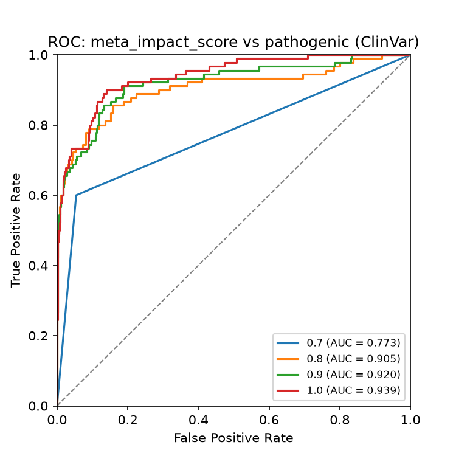
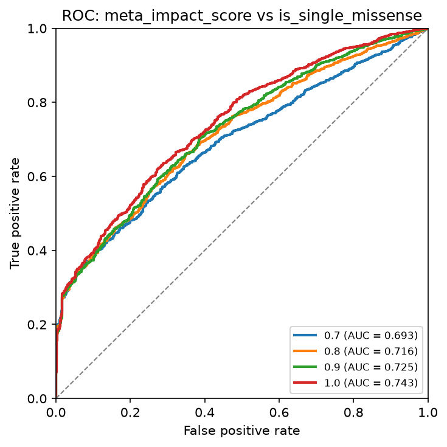
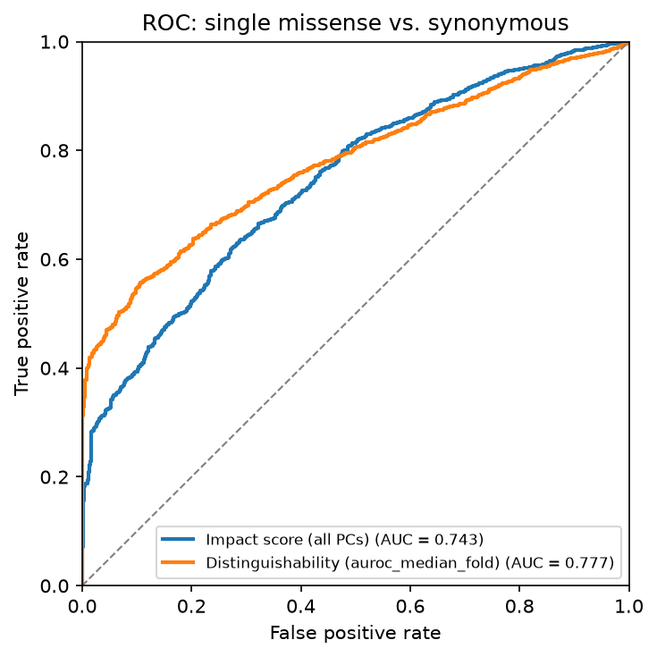
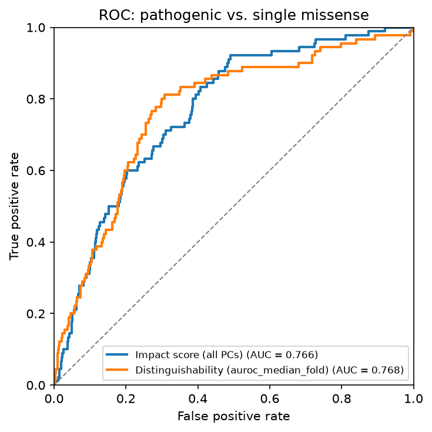
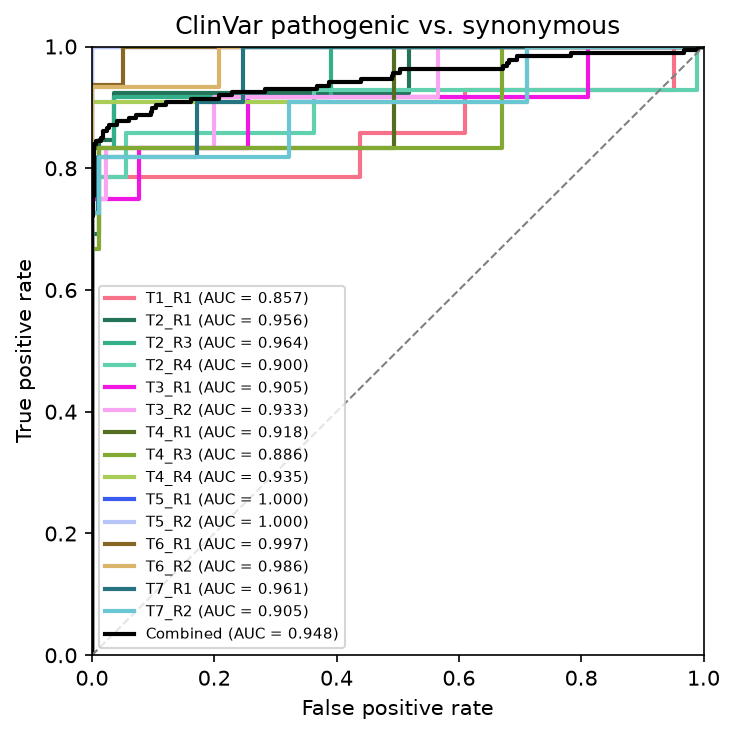

# ROC curves

`RocPlot` measures how well a score separates a **positive** class from a **negative** (control)
class of `label`. The negative class defaults to Synonymous. Rows with any other label are dropped.

## One curve per score column

```python
import fisseqborn as fb
from fisseqborn import fisseq

ratios = [0.7, 0.8, 0.9, 1.0]
(fb.RocPlot(df, label="meta_clinvar_annotation", positive=fisseq.PATHOGENIC,
            score=[f"meta_impact_score_{r}" for r in ratios],
            names={f"meta_impact_score_{r}": str(r) for r in ratios},
            title="ROC: meta_impact_score vs pathogenic (ClinVar)")
   .save("vis/roc_pathogenic.png"))
```

<div class="grid" markdown>





</div>

*Left: from `notebooks/2026-09-22/pca`. Right: the same sweep in `notebooks/2026-09-30/pca`, with
`label="meta_variant_type", positive="Single Missense"`. The AUC rises from 0.69 to 0.74
as more PCs are kept.*

Two different scores on the same variants, with an explicit `negative`:

```python
names = {"meta_impact_score_1.0": "Impact score (all PCs)",
         "meta_distinguishability_score": "Distinguishability (auroc_median_fold)"}
for negative in ["Synonymous", "Single Missense"]:
    (fb.RocPlot(scored, label="meta_clinvar_annotation", positive=fisseq.PATHOGENIC,
                negative=negative, score=list(names), names=names, figsize=(5, 5),
                title=f"ROC: pathogenic vs. {negative.lower()}")
       .legend(loc="lower right", fontsize="small")
       .save(f"vis/roc_pathogenic_vs_{negative}.png"))
```

<div class="grid" markdown>





</div>

*From `notebooks/2026-10-01/dist-vs-impact`. The left panel uses
`label="meta_variant_type", positive="Single Missense"`.*

Each legend entry reads `name (AUC = …)`. `names` maps score columns (or group levels) to shorter
display names.

## One curve per group

Pass `group=` to draw one curve per level of a column, such as each experiment. `combined=True` adds a
black curve over all groups pooled:

```python
(fb.RocPlot(df, label="meta_variant_type", positive="Single Missense",
            score="meta_distinguishability_score", group="meta_experiment", combined=True,
            palette=fisseq.batch_palette(df["meta_experiment"]))
   .legend(outside=True, fontsize=7)
   .save("vis/roc_by_experiment.png"))
```

{ width="420" }

*From `notebooks/2026-09-29/ovwtcv`: ClinVar pathogenic vs. synonymous on `auroc_median_fold`, one
curve per batch with `palette=fisseq.batch_palette(experiments)`. Batches with only a few
pathogenic variants give the step-shaped curves.*

`positive` and `negative` also accept lists of levels. For example,
`positive=["Single Missense", "Frameshift"]`.

## The AUC table

`RocPlot(...).aucs()` returns the numbers as a polars DataFrame, one row per curve, with columns
`curve`, `auc`, `n_positive` and `n_negative`. For example, here is a per-experiment AUC table
for two scoring strategies:

```python
roc_df = None
for score, name in {"auroc_median_fold": "median_fold_auc", "auroc_pooled": "pooled_auc"}.items():
    aucs = (fb.RocPlot(scores, label="meta_variant_type", positive="Single Missense",
                       score=score, group="meta_experiment")
            .aucs()
            .select(pl.col("curve").alias("meta_experiment"), pl.col("auc").alias(name)))
    roc_df = aucs if roc_df is None else roc_df.join(aucs, on="meta_experiment")
```
