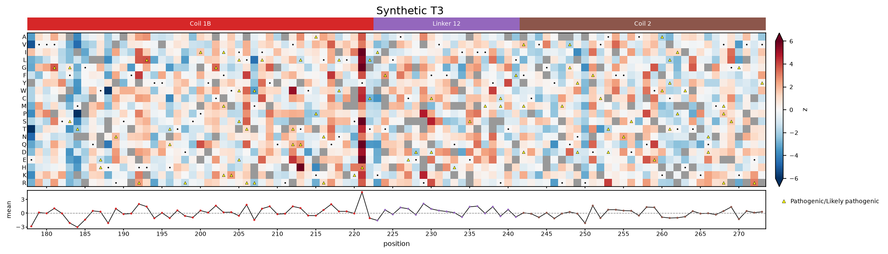
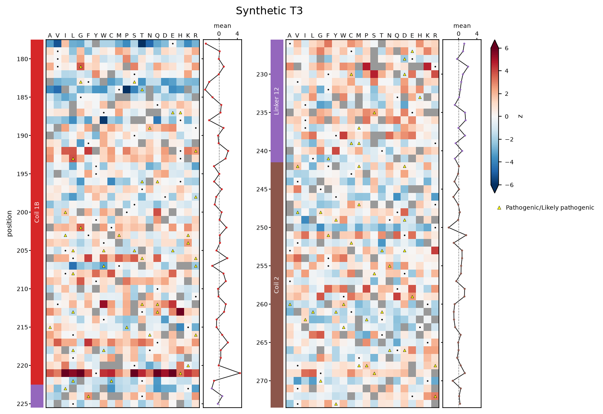

# Variant effect maps

`VariantEffectMap` draws one value per single substitution as a heatmap. Protein positions run
along x and the substituted amino acid down y, in `fisseq.AMINO_ACID_ORDER`
(`A V I L G F Y W C M P S T N Q D E H K R`). It follows the missense maps of the VIS-seq paper:

- Gray cells are variants with no value.
- A black dot marks each position's wild-type residue, which is the synonymous variant's cell.
- The color scale centers on 0 by default. Values beyond `vmin`/`vmax` get the end colors, and
  the colorbar shows an arrow.
- The bar above the heatmap names the protein regions (`fisseq.LMNA_DOMAIN_REGIONS` by
  default).
- The line below is each position's mean over its non-synonymous substitutions, with points
  colored by region.
- `marginal=True` adds a strip on the right with each amino acid's values, with a black line
  at the median. It is off by default.

Only single substitutions like `"A12V"` and `"A12A"` are drawn. Frameshifts, deletions,
nonsense, `|` multi-codon changes, `:<tag>` pseudo-variants and `"WT"` are ignored. When a variant
has several rows, for example one per batch, they are combined with `aggregate="median"`
(`"mean"`, `"min"`, `"max"` or `"first"` also work; `None` makes duplicates an error).

```python
import fisseqborn as fb
import polars as pl

feature = "Mean_NucleiExpanded_Intensity_MeanIntensity_CH1"
(fb.VariantEffectMap(profiles, feature, positions=(178, 273), vmin=-6, vmax=6,
                     title=fb.fisseq.LMNA_LANDMARK_FEATURES[feature])
   .highlight(pl.col("meta_clinvar_annotation") == fb.fisseq.PATHOGENIC,
              label=fb.fisseq.PATHOGENIC, color="yellow", marker="^")
   .save("vis/variant_map_t3.png"))
```



*Synthetic data. Every value is random, except that the synonymous variants are 0. The
ClinVar annotations are random too.*

## Highlighting variants

`.highlight(where, ...)` puts a marker on the cell of every variant with a row that matches
`where`, as `EmbeddingPlot.highlight` does with points. Rows are matched before `aggregate`
combines them. A cell gets marked even when its variant has no value. The marks appear on
every wrapped row. Each call is one layer, and later calls draw on top:

- `color` and `marker` set the style (default red circles with a black edge). Other keyword
  arguments go to `ax.scatter`, for example `s=` for the size.
- `label=` adds a legend entry below the colorbar.
- `hue=` colors the marks by a categorical column instead, with `palette=` for the colors
  and `missing_color=` for levels that have none. When a variant's matching rows disagree,
  its first non-null level wins.

```python
(fb.VariantEffectMap(profiles, feature, positions=(178, 273))
   .highlight(pl.col("meta_clinvar_annotation").is_not_null(),
              hue="meta_clinvar_annotation", label="ClinVar")
   .save("vis/variant_map_clinvar.png"))
```

## One figure per tile

`positions=(first, last)` limits the map to an inclusive range. Without it, the map covers every
substituted position in the data. To make one figure per library tile:

```python
for tile, first, last in fb.fisseq.LMNA_TILES:
    fb.VariantEffectMap(profiles, feature, positions=(first, last), vmin=-6, vmax=6,
                        title=tile).save(f"vis/variant_map_{tile}.png")
```

## The whole protein, wrapped

`positions_per_row=` splits the range into stacked rows that share one colorbar. Every row
keeps the same cell width, so the last, shorter row just ends early:

```python
fb.VariantEffectMap(profiles, feature, positions_per_row=170, vmin=-6, vmax=6).save(
    "vis/variant_map_full.png"
)
```

## Portrait

`orientation="portrait"` turns the map on its side. Positions run down the page and amino
acids across the top. The region bar moves to the left of the heatmap and the position means
to the right (below for the `marginal` strip). With `positions_per_row=`, the wrapped
ranges become side-by-side columns:

```python
fb.VariantEffectMap(profiles, feature, positions=(178, 273), positions_per_row=48,
                    orientation="portrait", vmin=-6, vmax=6).save("vis/variant_map_tall.png")
```



## Panels and colors

- `regions=None` hides the region bar. A different mapping (name -> inclusive range) labels
  another protein. `region_palette=` sets its colors.
- `position_mean=False` hides the line below.
- `marginal=True` adds the per-amino-acid strip.
- `wild_type_marker=False` drops the dots.
- `cmap`, `vmin`, `vmax`, `center` and `clip` set the color scale. Without limits, the scale is
  symmetric around `center` and spans the largest deviation, capped at `clip`.
- `missing_color` sets the color of missing variants, and `cbar_label` the colorbar label
  (default: the value column).

The numbers behind the plot are `.matrix()` (amino acids by positions, NaN where a variant is
missing), `.position_means()`, `.wild_type()` (position -> residue) and `.cells` (one row per
drawn variant).

The plot is figure-level. `.plot()` returns the figure and a `VariantEffectMapAxes`, which has
one entry per row (per column in portrait) in `heatmaps`, `regions`, `means` and `marginals`.
Layers such as `.set(...)` apply to the first heatmap. `.highlight()` is the exception: it
marks every heatmap.
