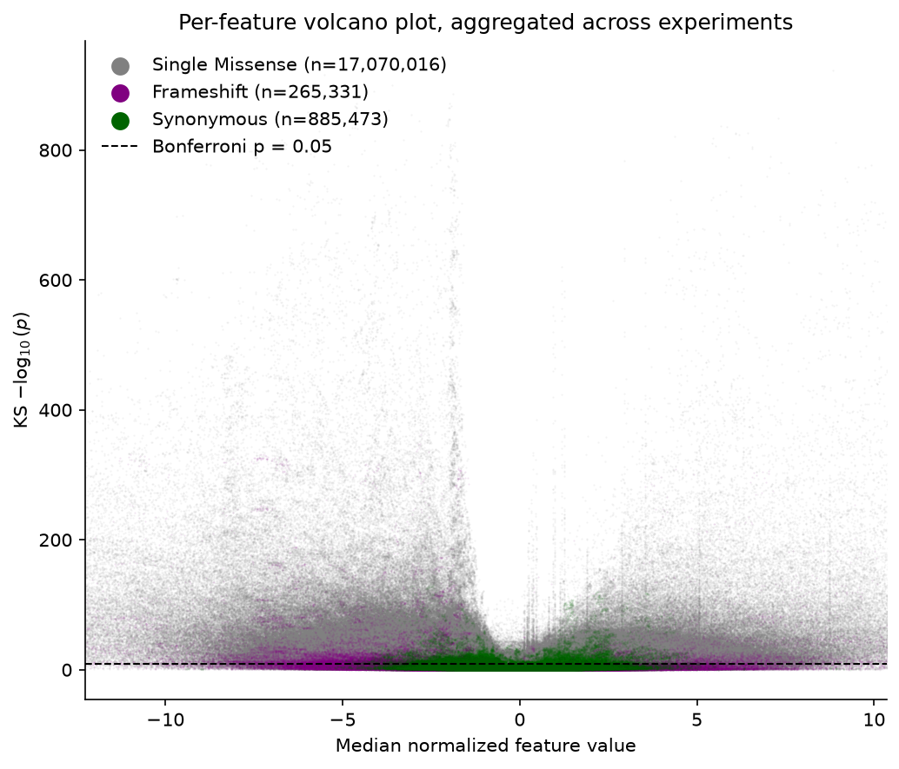
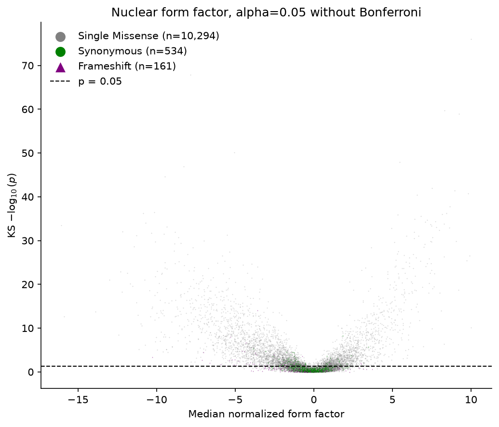

# Volcano plots

`VolcanoPlot` plots per-feature effect sizes against −log10(p), one point per
(variant, feature) pair. Points are added in groups with chained `.layer(where, label=…)` calls,
each selecting rows with a polars expression. Layers are drawn in the order they are added, so add
the largest group first and the controls last to keep them visible. Each legend entry counts its
points.

## All features, layered by variant type

`VolcanoPlot.from_wide` takes one row per variant with `<feature>_median` / `<feature>_KSnegLogP`
column pairs, as written by the pipeline, and unpivots them. Here `agg_df` is the per-variant
median across experiments, where each feature's p-value comes from the same experiment as its
median:

```python
import polars as pl
import fisseqborn as fb

volcano = fb.VolcanoPlot.from_wide(
    agg_df, title="Per-feature volcano plot, aggregated across experiments"
)
# back to front: missense cloud, then frameshifts, then synonymous controls on top
for variant_type in ["Single Missense", "Frameshift", "Synonymous"]:
    volcano = volcano.layer(pl.col("meta_variant_type") == variant_type, label=variant_type)

(volcano
   .set(xlabel="Median normalized feature value", ylabel=r"KS $-\log_{10}(p)$")
   .save("vis/volcano.png"))
```

{ width="560" }

*From `notebooks/2026-09-28/volcano-plots`: ~18 million points. The synonymous controls stay
near zero effect, while missense and frameshift variants spread out in both directions.*

By default:

- the dashed line marks Bonferroni-corrected p = 0.05 over every plotted point;
- the x axis is limited to the 0.1–99.9% quantiles (`x_quantiles=(0.001, 0.999)`), so a few
  extreme values don't squash the rest;
- rows with a missing or non-finite value are neither drawn nor counted.

## One feature, uncorrected threshold

To look at one feature, select its column pair before `from_wide`. `bonferroni=False` draws the
plain `alpha` line, `x_quantiles=None` shows every point, and each `.layer()` can override the
scatter style (`color`, `marker`, `alpha`, …):

```python
feat = "Mean_Nuclei_AreaShape_FormFactor"
one = agg_df.select(pl.col("^meta_.*$"), f"{feat}_median", f"{feat}_KSnegLogP")

(fb.VolcanoPlot.from_wide(one, bonferroni=False, x_quantiles=None,
                          title="Nuclear form factor, alpha=0.05 without Bonferroni")
   .layer(pl.col("meta_variant_type") == "Single Missense", label="Single Missense", alpha=0.3)
   .layer(pl.col("meta_variant_type") == "Synonymous", label="Synonymous",
          color="green", alpha=0.5)
   .layer(pl.col("meta_variant_type") == "Frameshift", label="Frameshift",
          marker="^", alpha=0.6)
   .set(xlabel="Median normalized form factor", ylabel=r"KS $-\log_{10}(p)$")
   .save("vis/volcano_form_factor.png"))
```

{ width="560" }

!!! warning
    The legend enlarges markers tenfold so tiny points stay readable. If you set a large `s=` on
    a layer, its legend marker becomes huge too. Keep the default size and use `alpha` or `marker`
    to tell layers apart.

    `alpha=` on the **constructor** is the significance level, not transparency. Set point
    transparency per `.layer()`.

## Long-form data

The constructor takes long-form rows directly, for example after your own unpivot:

```python
fb.VolcanoPlot(long_df, x="median", y="KSnegLogP", alpha=0.01)
```
