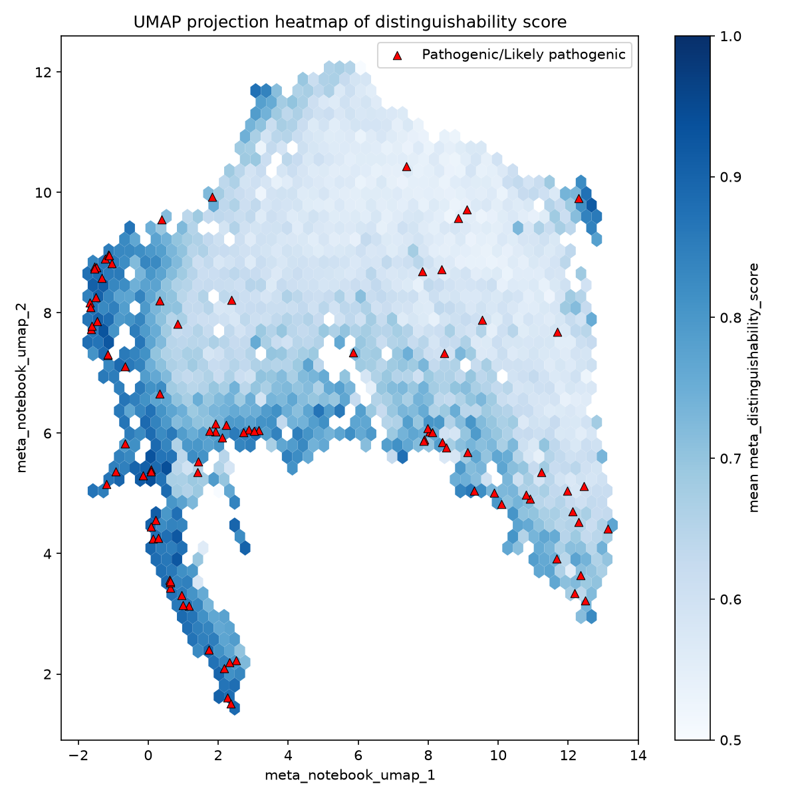
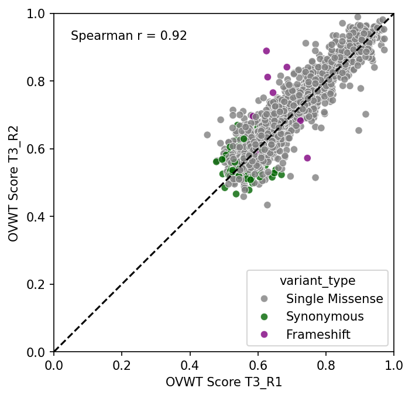
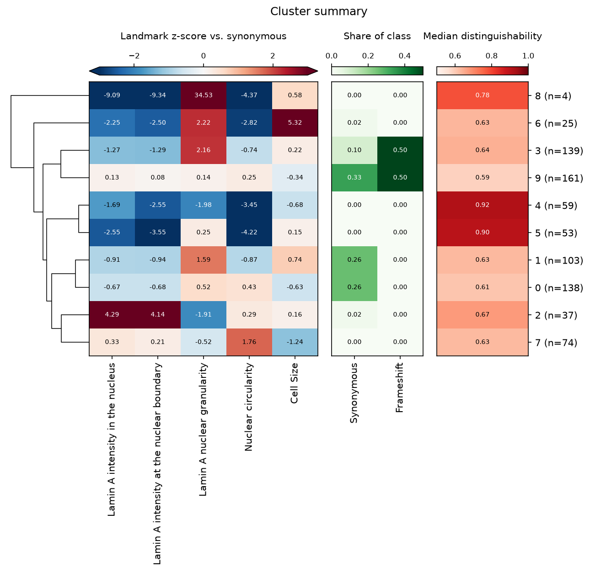

# fisseqborn

Seaborn-style, object-oriented plots for the fisseq project. You pass a **polars** DataFrame and the
columns to plot, chain any extras (significance stars, reference lines, highlighted points), and then
`plot()` or `save()`.

```python
import polars as pl
import fisseqborn as fb
from fisseqborn import fisseq

(fb.BoxPlot(df, x="meta_clinvar_annotation", y="meta_impact_score", points="density")
   .annotate_pairs()
   .save("vis/impact_score_box.png"))
```

It packages the figures the analysis notebooks kept re-implementing by copy-paste. The fisseq
conventions come built in:

- the variant-type palette, with pathogenic in red
- canonical category orders
- `dpi=150`
- raw column names as axis labels

## Installation

fisseqborn needs Python 3.13 or newer.

```sh
uv add "fisseqborn @ git+https://github.com/<org>/fisseqborn"
# or, from a local checkout
uv pip install -e path/to/fisseqborn
```

## Gallery

These figures come from the fisseq analysis notebooks. Each links to the page with the fisseqborn
call that makes that kind of figure.

<div class="grid" markdown>

[{ width="240" }](plots/box.md)
[{ width="240" }](plots/embedding.md)
[{ width="240" }](plots/correlation.md)
[{ width="240" }](plots/roc.md)
[{ width="240" }](plots/heatmap.md)
[{ width="240" }](plots/clustermap.md)

</div>

## Next steps

- [Concepts](concepts.md): how plots, layers, `plot()` and `save()` fit together.
- [The fisseq theme](theme.md): palettes, orders and LMNA reference data.
- [Loading pipeline outputs](data.md): chainable `Profiles`, `OvwtScores` and `Blocklists`.
- One page per plot type in the navigation, with examples.
- [API reference](api.md): every parameter.
