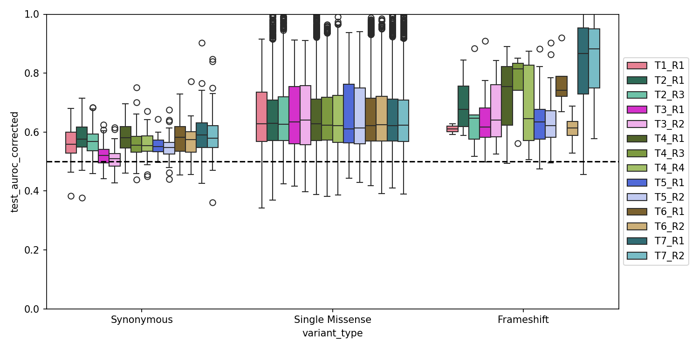

# Boxplots

`BoxPlot` draws a boxplot of `y` for each level of `x`. You can split each box further by `hue`,
overlay the individual points, and add significance brackets.

## Score by variant class, with significance stars

```python
import fisseqborn as fb
from fisseqborn import fisseq

(fb.BoxPlot(
    df,
    x="meta_clinvar_annotation",
    y="meta_impact_score_0.9",
    order=["Synonymous", "Single Missense", fisseq.PATHOGENIC],
    points="density",
    title="Impact score (variance ratio = 0.9)",
 )
 .annotate_pairs()
 .save("vis/impact_score_box_0.9.png"))
```

{ width="480" }

*From `notebooks/2026-09-22/pca`.*

- **`points`:**
    - `"density"` draws jittered points colored by how dense each box's distribution is at that value
      (viridis), as in this figure.
    - `"strip"` draws translucent black points instead.
    - Either way, fliers are hidden.
- **`annotate_pairs()`:** runs a Mann-Whitney test between every pair of boxes by default and draws
  the stars with statannotations. It always tests the plot's own `x`/`y` columns, so the stars can't
  come from a different column than the one plotted. Pass `pairs=[("Synonymous", fisseq.PATHOGENIC)]`
  to choose specific comparisons, or `test="t-test_welch"`, `loc="outside"`, and so on.
- **`show_counts=True`** (the default): appends `(n = …)` to each tick label.

## Per-experiment boxes

With `hue`, each `x` level gets one box per hue level. `fisseq.batch_palette` gives replicates of a
tile related colors:

```python
(fb.BoxPlot(
    df,
    x="meta_variant_type",
    y="test_auroc_corrected",
    hue="meta_experiment",
    palette=fisseq.batch_palette(df["meta_experiment"]),
    show_counts=False,
    figsize=(10, 5),
 )
 .refline(y=0.5)
 .set(ylim=(0, 1))
 .legend(outside=True)
 .save("vis/by-experiment-corrected.png"))
```



*From `notebooks/2026-07-28/ovwt`.*

With `hue`, `annotate_pairs()` compares hue levels **within** each `x` level. For example,
`BoxPlot(df, x="meta_experiment", hue="meta_variant_type", …).annotate_pairs()` tests
Synonymous vs. Single Missense vs. Frameshift inside every experiment. Pairs that involve an empty group
are skipped.
