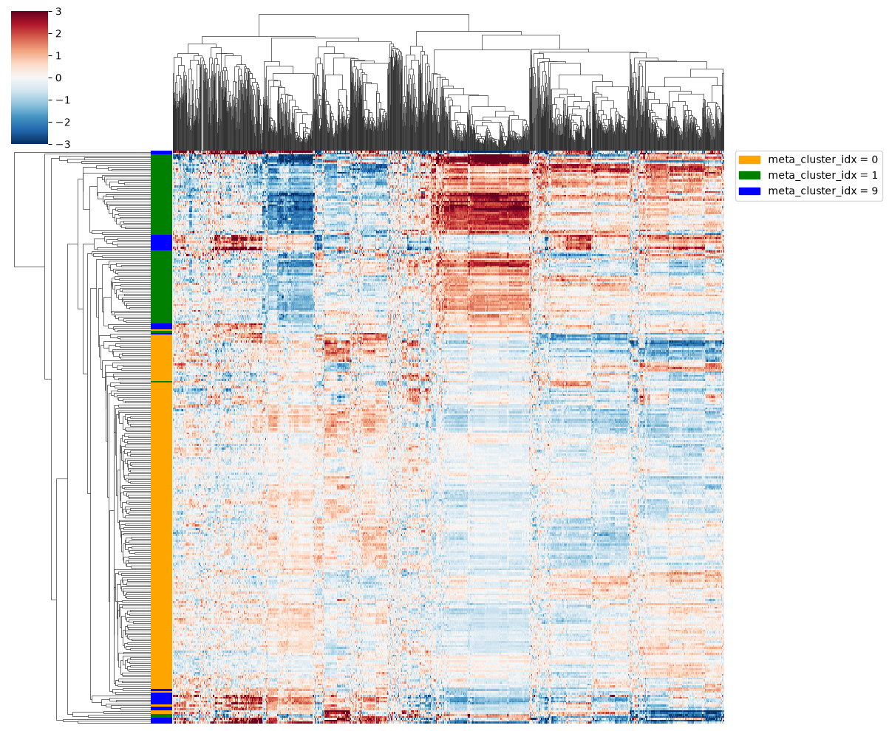

# Clustermaps

`ClusterMap` draws a hierarchically clustered heatmap with one row per DataFrame row. It is
figure-level, so it builds its own figure and `plot()` doesn't accept `ax=`.

## All features at once

By default every column that doesn't start with `meta_` is a feature. The features form a single block
on a diverging `RdBu_r` scale clipped at ±3, and both rows and features are clustered. `row_colors` adds
a color strip and legend from a categorical column:

```python
import polars as pl
import fisseqborn as fb

synonymous = profiles.filter(pl.col("meta_clinvar_annotation") == "Synonymous")
(fb.ClusterMap(synonymous, row_colors="meta_cluster_idx",
               row_palette={"0": "orange", "1": "green", "9": "blue"})
   .save("vis/synonymous_clustermap.png"))
```

{ width="560" }

*From `notebooks/2026-09-11/synonymous-clustering`, where it was drawn with `sns.clustermap`.*

Feature columns containing null, NaN or inf are dropped with a logged warning, because clustering
can't handle them.

## Feature groups: choosing what drives the clustering

A summary figure often mixes features on different scales, such as landmark z-scores, class
proportions and a score, and only some of them should decide the row order. Split the features into
`FeatureGroup`s. Each group:

- is drawn as its own block, with its own colormap and colorbar;
- with `cluster=True` (the default), is used when clustering the rows;
- with `cluster=False`, is only displayed, in the row order the other groups produce.

```python
from fisseqborn import FeatureGroup, fisseq

landmarks = {f"{k}_median": v for k, v in fisseq.LMNA_LANDMARK_FEATURES.items()}

# one row per cluster
fb.ClusterMap(
    cluster_summary,
    row_labels="label",                 # e.g. "6 (n=737)"
    standardize=True,
    title="Cluster summary",
    groups=[
        FeatureGroup("Landmark z-score vs. synonymous", list(landmarks),
                     cmap="RdBu_r", center=0, clip=3, labels=landmarks, annot=True),
        FeatureGroup("Share of class", ["Synonymous", "Frameshift"],
                     cmap="Greens", vmin=0, annot=True),
        FeatureGroup("Median distinguishability", "median_distinguishability",
                     cluster=False, cmap="Reds", vmin=0.5, vmax=1, labels=False, annot=True),
    ],
).save("vis/cluster_summary.png")
```


*Drawn by fisseqborn on real FISSEQ profiles (k-means clusters of the T1_R1 median aggregates). The
median distinguishability block has `cluster=False`, so it doesn't affect the order of the rows.*

`standardize=True` z-scores each clustering feature before distances are computed, so blocks on
different scales weigh in comparably. Zero-variance features are then left out. This matches the
original notebook helper. It only changes the ordering, not the colors.

Other options per group:

| Option | Does |
|---|---|
| `cluster_features=True` | also reorder the features inside the block by clustering them |
| `labels=` | `True`/`False`, or a mapping to display names (e.g. `fisseq.LMNA_LANDMARK_FEATURES`) |
| `annot=True`, `fmt=` | write each cell's value, with text color chosen for contrast |
| `cmap`, `vmin`, `vmax`, `center`, `clip` | the block's color scale |

Groups with `cluster=False` keep their missing values, drawn in light grey.

For comparison, here is the notebook figure that feature groups replace. It stacks the groups
vertically, with clusters as columns. fisseqborn places them side by side, with one row per cluster.


*From `notebooks/2026-09-22/pca` (`fisseqstuff.vis.plot_cluster_summary`).*

## What `plot()` returns

`plot()` returns `(fig, ClusterMapAxes)`, which holds:

- `heatmap_axes` and `colorbar_axes`, dicts keyed by group name;
- `row_dendrogram_ax` and `row_colors_ax`;
- `row_order`, the input row positions from top to bottom;
- `feature_order` for each group;
- `row_linkage`, the scipy linkage used to order the rows.

`ClusterMap(...).row_order()` computes the order without drawing, for example to reuse the same row
order in a table.
