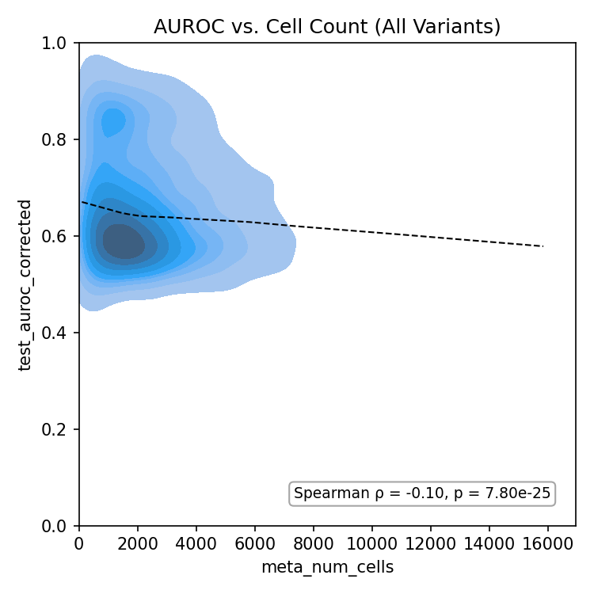

# Correlation scatter

`CorrelationPlot` compares two numeric columns, for example replicate vs. replicate, filtered vs.
unfiltered, or a score vs. cell count. It can add:

- a correlation box (`stat="pearson"` or `"spearman"`, computed over rows where both values are finite)
- a fit line (`fit="linear"` or `"lowess"`)
- the `y = x` line (`identity=True`)
- counts of the points above and below that line (`count_sides=True`)

## Replicate vs. replicate

The two replicates are usually joined side by side first (here with polars' `_right` suffix):

```python
import fisseqborn as fb

pairs = t3_r1.join(t3_r2, on="meta_aa_changes")   # test_auroc, test_auroc_right

(fb.CorrelationPlot(pairs, x="test_auroc", y="test_auroc_right", hue="meta_variant_type",
                    stat="spearman", stat_loc="upper left", identity=True, lims=(0, 1))
   .set(xlabel="OVWT Score T3_R1", ylabel="OVWT Score T3_R2")
   .save("vis/T3_R1_vs_T3_R2_ovwt_scatter.png"))
```

{ width="420" }

*From `notebooks/2026-07-29/ovwt_rep_correlation`.*

## Score vs. cell count

`kind="kde"` draws a filled 2-D density in place of the points, and `fit="lowess"` adds a dashed LOWESS
trend:

```python
(fb.CorrelationPlot(df, x="meta_num_cells", y="test_auroc_corrected",
                    kind="kde", fit="lowess", stat="spearman",
                    title="AUROC vs. Cell Count (All Variants)")
   .set(ylim=(0, 1), xlim=(0, None))
   .save("vis/auroc_vs_num_cells_kde_all.png"))
```

{ width="420" }

*From `notebooks/2026-07-30/ovwt_scores_cell_count`. Without `hue`, fisseqborn's KDE uses viridis
with a density colorbar. Pass `cmap=` or `cbar=False` to change that.*

Use `CorrelationPlot(...).correlation()` to get `(statistic, p_value, n)` without drawing anything.
