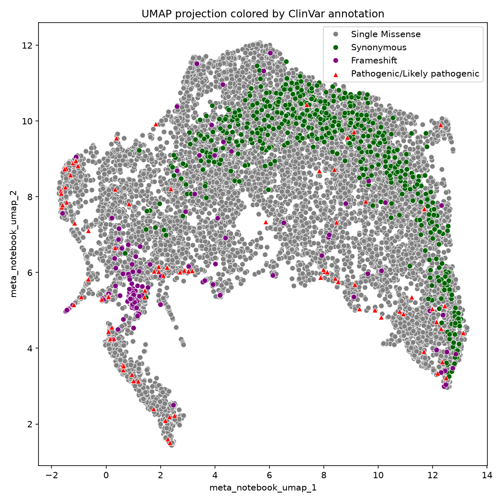
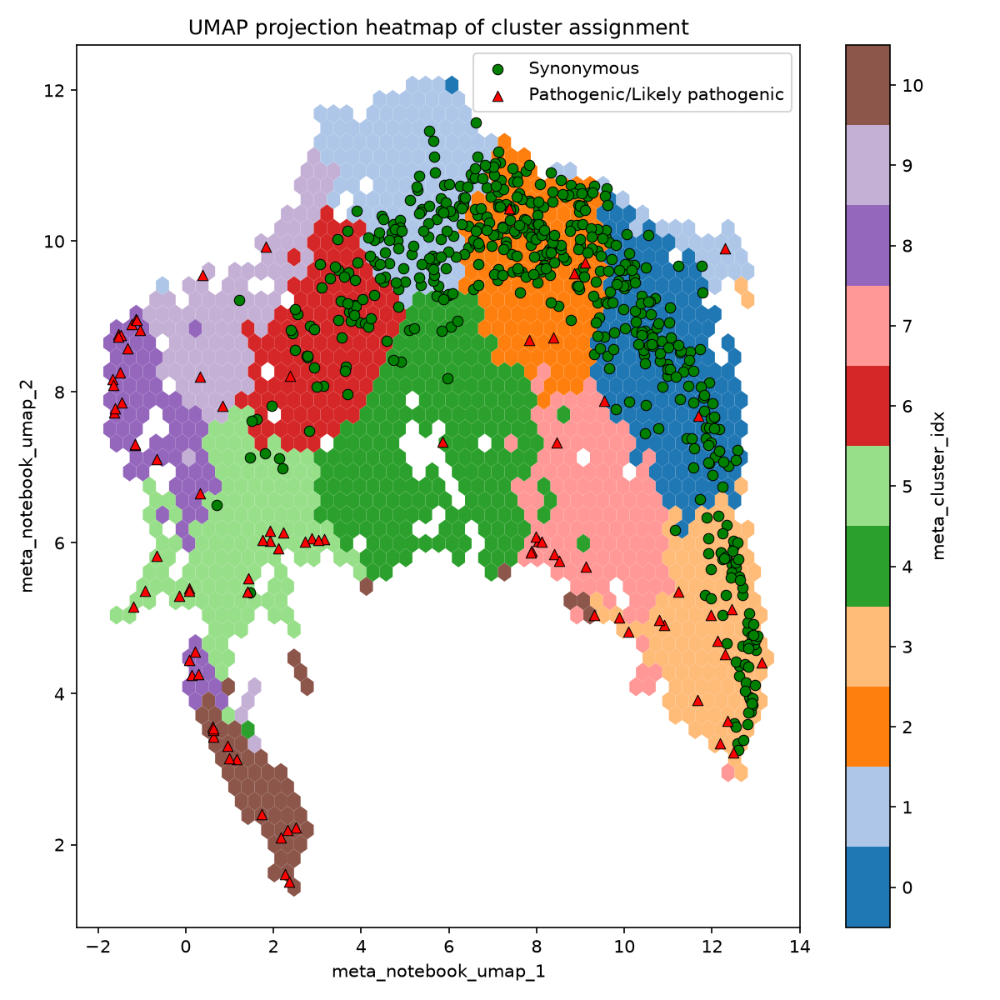
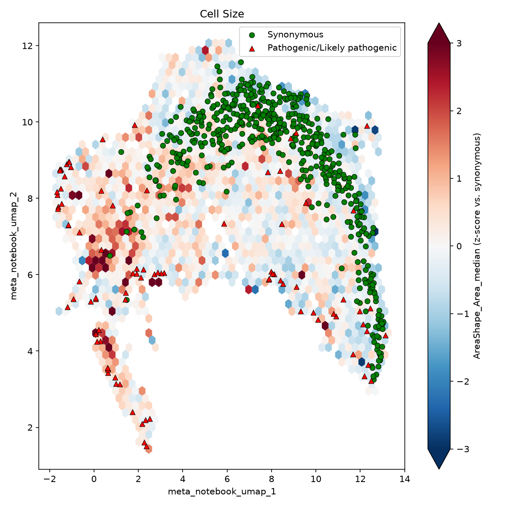

# Embeddings (UMAP / PCA)

`EmbeddingPlot` draws two embedding coordinates colored by `hue`, either as points
(`kind="scatter"`) or aggregated into hexagons (`kind="hexbin"`). How `hue` is drawn depends on its
type:

| `hue` | `kind="scatter"` | `kind="hexbin"` |
|---|---|---|
| categorical | discrete palette + legend | most common level per hexagon, labelled colorbar |
| numeric | colormap + colorbar | mean per hexagon + colorbar |
| `None` | plain points | point count per hexagon |

`.highlight(where, …)` draws a subset of rows on top, such as synonymous controls or pathogenic
variants. `where` is any polars expression.

## Colored by variant class, with pathogenic variants on top

```python
import polars as pl
import fisseqborn as fb
from fisseqborn import fisseq

UMAP = dict(x="meta_notebook_umap_1", y="meta_notebook_umap_2")

(fb.EmbeddingPlot(df, **UMAP, hue="meta_variant_type",
                  title="UMAP projection colored by ClinVar annotation")
   .highlight(pl.col("meta_clinvar_annotation") == fisseq.PATHOGENIC,
              label=fisseq.PATHOGENIC, color="red", marker="^")
   .save("vis/global_umap_clinvar_annotation.png"))
```

{ width="520" }

*From `notebooks/2026-09-22/pca`.*

Categories are drawn largest first, so rare classes stay visible on top of the Single Missense cloud.
Pass `draw_order=[…]` to control the order yourself.

## Hexbin of a continuous score

```python
(fb.EmbeddingPlot(df, **UMAP, hue="meta_distinguishability_score", kind="hexbin",
                  cmap="Blues", vmin=0.5, vmax=1,
                  colorbar_label="mean meta_distinguishability_score",
                  title="UMAP projection heatmap of distinguishability score")
   .highlight(pl.col("meta_clinvar_annotation") == fisseq.PATHOGENIC,
              label=fisseq.PATHOGENIC, color="red", marker="^")
   .save("vis/global_umap_distinguishability_score_heatmap.png"))
```

{ width="520" }

*From `notebooks/2026-09-22/pca`.*

## Hexbin of cluster assignment

A categorical `hue` with `kind="hexbin"` colors each hexagon by its most common level:

```python
(fb.EmbeddingPlot(df, **UMAP, hue="meta_cluster_idx", kind="hexbin",
                  title="UMAP projection heatmap of cluster assignment")
   .highlight(pl.col("meta_variant_type") == "Synonymous", label="Synonymous", color="green")
   .highlight(pl.col("meta_clinvar_annotation") == fisseq.PATHOGENIC,
              label=fisseq.PATHOGENIC, color="red", marker="^")
   .save("vis/umap_cluster_heatmap.png"))
```

{ width="520" }

*From `notebooks/2026-09-22/pca`.*

## Diverging z-scores

`center=0` makes the color range symmetric around zero, with its half-width capped at `clip` (default
3). The colorbar gets arrows when values fall outside the range. Here the loop draws one figure per
landmark feature:

```python
syn = df.filter(pl.col("meta_variant_type") == "Synonymous")
for feature, name in fisseq.LMNA_LANDMARK_FEATURES.items():
    col = f"{feature}_median"
    zdf = df.with_columns((pl.col(col) - syn[col].mean()) / syn[col].std())
    (fb.EmbeddingPlot(zdf, **UMAP, hue=col, kind="hexbin", cmap="RdBu_r", center=0,
                      colorbar_label=f"{col} (z-score vs. synonymous)", title=name)
       .highlight(pl.col("meta_variant_type") == "Synonymous", label="Synonymous", color="green")
       .highlight(pl.col("meta_clinvar_annotation") == fisseq.PATHOGENIC,
                  label=fisseq.PATHOGENIC, color="red", marker="^")
       .save(f"vis/landmark_heatmap_{feature}.png"))
```

{ width="520" }

*From `notebooks/2026-09-22/pca`.*

## Highlights colored by a column

`highlight(..., hue=col)` colors each overlaid point by its level of `col` instead of one color.
When the base plot's palette has a color for every highlighted level, that palette is used, so an
overlay of variants from an earlier clustering matches the hexbin's cluster colors. Levels are also
matched as strings, so integer cluster ids match string ones. Pass `palette=` to choose the colors
yourself; levels without a color are drawn in `missing_color` (white by default).

```python
old = fb.Dataset.read("profiles_with_clusters.parquet").select(
    "meta_aa_changes", pl.col("meta_cluster_idx").alias("meta_old_cluster_idx")
)
(fb.EmbeddingPlot(df.join(old, how="left"), **UMAP, hue="meta_cluster_idx", kind="hexbin",
                  palette="tab20")
   .highlight(pl.col("meta_old_cluster_idx").is_not_null(), hue="meta_old_cluster_idx",
              label="Synonymous")
   .save("vis/umap_old_clusters.png"))
```
